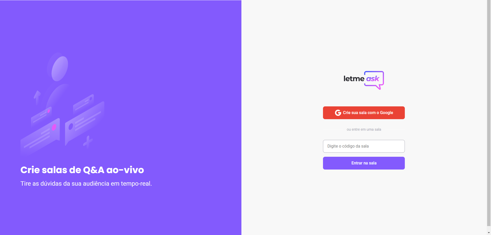

<h1 align="center">
    <a href="https://pt-br.reactjs.org/">🔗 Trilha: React</a>
  

    
Aplicativo: LetMeAsk

</h1>

  
  

 

 <a href="#objetivo">Objetivo</a> •
 <a href="#features">Features</a> • 
 <a href="#banner">Banner</a> • 
 <a href="#tecnologias">Tecnologias</a> • 
 <a href="#licenc-a">Licença</a> • 
 <a href="#autor">Autor</a>

 

<h4 align="center"> 
	🚧  Status: 🚀 Pode melhorar  🚧
</h4>

<h3 id="objetivo">
   
🚀 Objetivo:   -Treinar fundamentos e conhecimentos em React, utilizando Typescript, Firebase e Scss.

</h3>

### ⚙Features

- [x] Criação de salas
- [x] Visão diferente entre usuários e admins
- [x] Criação de perguntas
- [ ] Caixa de resposta
- [ ] Banner de sala

<h1 align="center" id="banner">
  
</h1>

### 🛠 Tecnologias

As seguintes ferramentas foram usadas na construção do projeto:

- [React](https://pt-br.reactjs.org/)
- [TypeScript](https://www.typescriptlang.org/)
- [Yarn](https://yarnpkg.com/)
- [Firebase](https://firebase.google.com/?hl=pt)
- [Sass](https://sass-lang.com/)

